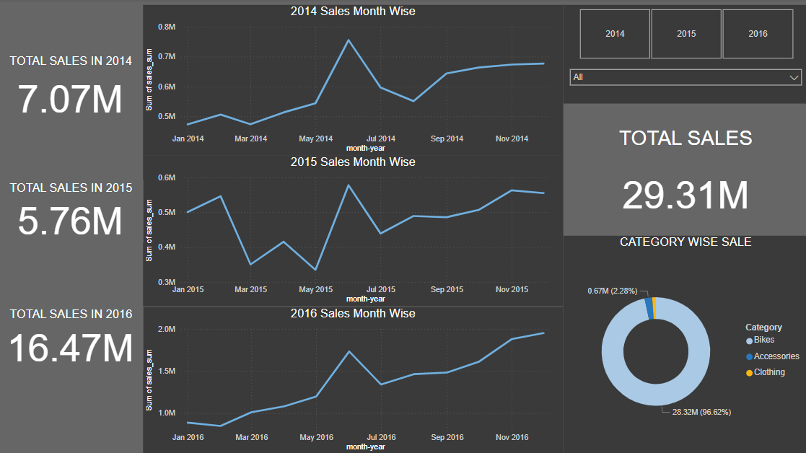

# Budget Sales Analysis Project

## Overview

This project aims to analyze sales and budget data for domain sales over a three-year period (2014-2016). The goal is to evaluate sales performance, conduct variance analysis, and provide insights into customer demographics and purchasing behavior.

## Objectives

- **Evaluate Sales Performance:** Analyze total sales trends and identify top-performing products and domains.
- **Variance Analysis:** Compare actual sales against budgeted figures to identify deviations.
- **Customer Insights:** Understand customer demographics and purchasing patterns.
- **Dashboard Development:** Create a Power BI dashboard to visualize key metrics and support data-driven decision-making.

## Data

The analysis was performed on a dataset containing raw domain sales and budget data for three years. The data was cleaned, and exploratory data analysis (EDA) was conducted to extract meaningful insights.

## Tools Used

- **Python**: Data loading, cleaning, and exploratory data analysis (EDA)
- **PostgreSQL**: Database management and query execution
- **Power BI**: Dashboard creation and visualization of insights

## Key Insights

### Sales Overview

- **Total Sales**: There was a significant increase in total sales from 2014 to 2016, with 2016 showing the highest sales at $16.47M. The cumulative total sales across all categories amounted to $29.31M, indicating a strong market presence.
  
- **Monthly Sales Trends**: Sales trends across the three years show fluctuations, with noticeable peaks in certain months such as May 2014, May 2015, and May 2016.



### Budget vs. Sales Analysis

- **Stable Positive Variance**: Some products like the Water Bottle (30 oz.) consistently showed sales lower than the budget, indicating possible overestimation.
  
- **High Positive Variance**: The Patch Kit/8 Patches had significant underperformance compared to budget, with the gap widening over time.
  
- **Consistent Negative Variance**: The Hydration Pack (70 oz.) consistently exceeded the budget, suggesting an underestimation of sales.

```python


df_accessories = df_variance_final[df_variance_final['Category'] == 'Accessories']

num_products = len(df_accessories)


fig, axes = plt.subplots(nrows=num_products, ncols=1, figsize=(12, num_products * 3))
sns.set(style="whitegrid")
colors = sns.color_palette("husl", num_products) 

if num_products == 1:
    axes = [axes]


for i, (index, row) in enumerate(df_accessories.iterrows()):
    product_name = row['ProductName']
    variance_data = row.iloc[4:]  # Variance columns (all month columns)

    # Plotting on the respective axis
    axes[i].plot(variance_data, marker='o', label=product_name,color=colors[i])
    axes[i].axhline(y=0, color='black', linestyle='--', linewidth=1)
    axes[i].set_title(f'Variance (Budget - Sales) for {product_name} (2016)')
    axes[i].set_xlabel('Month')
    axes[i].set_ylabel('Variance')
    axes[i].legend(loc='upper left')
    axes[i].set_xticklabels(variance_data.index, rotation=45)

# Adjust layout to avoid overlap
fig.suptitle('Variance Analysis of Accessories (2016)', fontsize=16)
plt.tight_layout(rect=[0, 0, 1, 0.96])
plt.show()
```


### Sales Performance by Product

- **Top Performing Products**: The Mountain-200 Black and Mountain-200 Silver variants were the leading products in terms of sales, followed closely by the Road-150 Red series.
  
- **Consistency in Sales**: The top products displayed minimal differences in sales, suggesting stable demand across the observed period.
  
- **Growth Opportunities**: Expanding the product line or introducing new features within the top-performing series could drive further sales.


### Customer Demographics

- **Geographical Sales Insights**: Strong sales were observed in regions like Australia and the United States, indicating market dominance in these areas. Strategic investments in marketing and inventory for these regions could enhance profitability and market share.


### KPI and Growth
 Sales growth rate over the year 2014 - 2016

 

## Conclusion and Recommendations

- **Strong Sales Growth**: The sales trend from 2014 to 2016 shows a consistent upward trajectory, with 2016 experiencing the highest sales. Continued focus on high-performing categories can sustain this growth.
  
- **Product Focus**: The Mountain-200 series, particularly the Black and Silver variants, are clear market leaders. Expanding this product line could drive further sales.
  
- **Budget Realignment**: Products showing significant positive variance should have their budgets realigned to better reflect actual sales performance.
  
- **Geographical Targeting**: Regions like Australia and the United States should receive targeted marketing efforts to capitalize on existing market dominance.

## Appendix

- **Sales Overview**
- **Budget vs. Sales**
- **Sales Performance by Product**
- **Customer Demographics**
- **KPI And Growth**